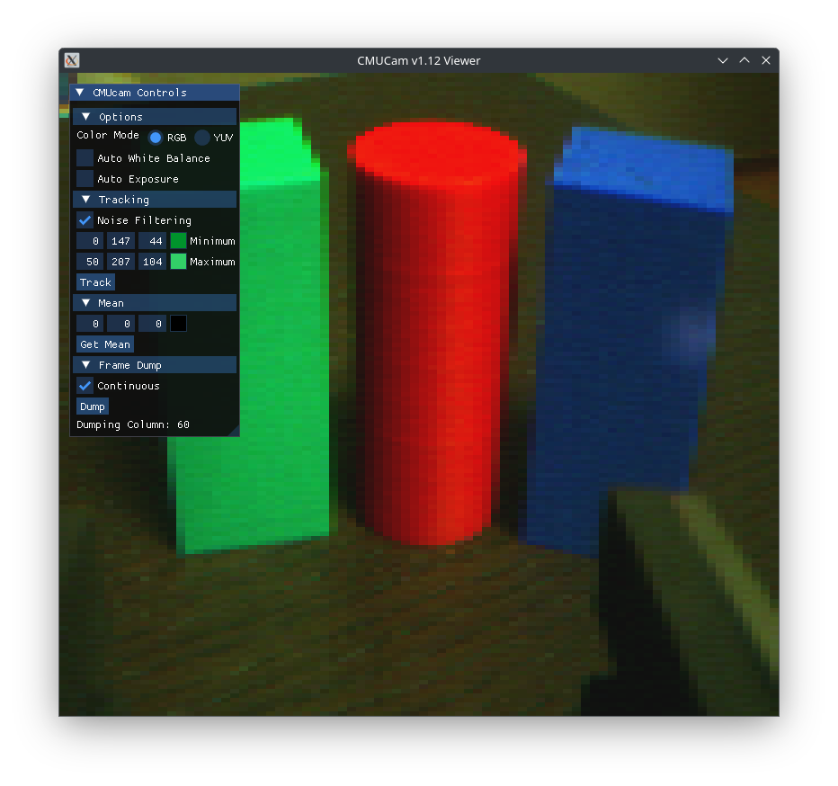
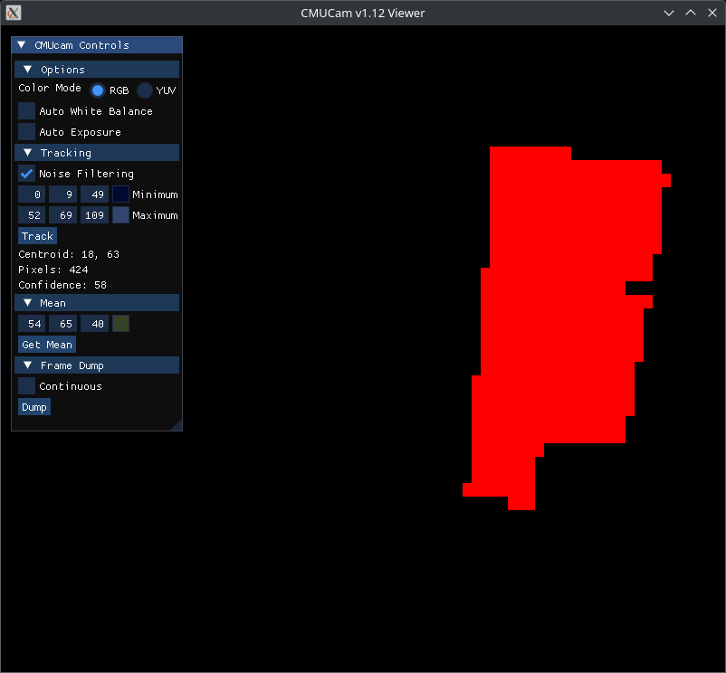
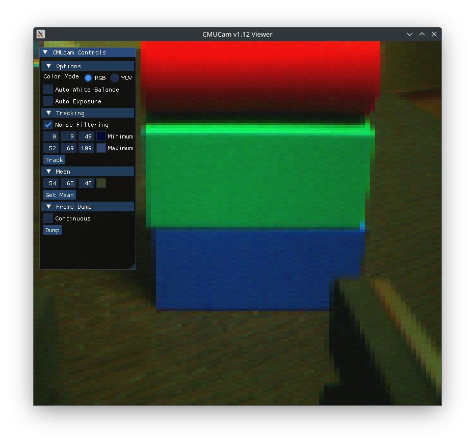
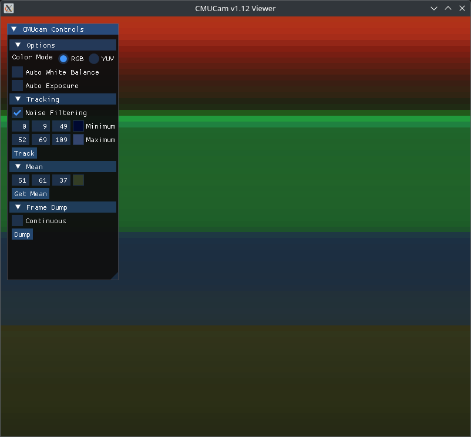
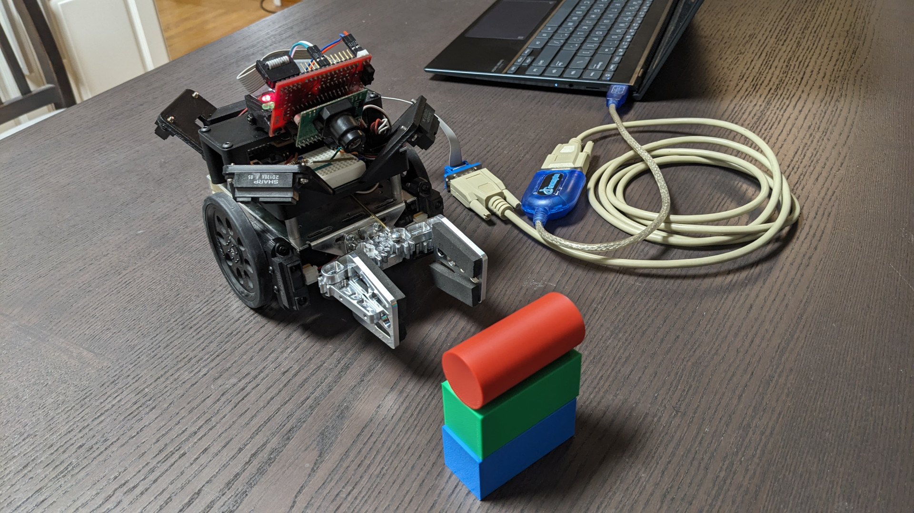

# cmucam-viewer

A simple SDL2 application for interacting with a CMUcam v1

[https://www.cs.cmu.edu/~cmucam/downloads.html].

## Dependencies

- SDL2
- GLEW
- OpenGL

## Building

```
git clone --recurse-submodules https://github.com/teknoman117/cmucam-viewer
cd cmucam-viewer
cmake -GNinja -DCMAKE_BUILD_TYPE=Release -B build/Release .
cmake --build build/Release -j
build/Release/src/cmucam-viewer -d <path to CMUcam tty>
```

## Demos

### Live Frame Dump

In glorius subsampled 160x143 over a 115.2 kb/s serial link


### "Line Mode" Extended Data

| Frame Dump | Tracking the Blue Block |
| ---------- | ----------------------- |
|  |  |

| Frame Dump | Displaying Per-Line Color Average |
| ---------- | --------------------------------- |
|  |  |

## Inspiration

So why does one write a CMUcam 1 viewer in ~~2022~~ 2025?

It started with a conversion at an HBRC meeting about "retro" homebrew robotics, which led me to revive some of my childhood robotics gear: Basic Stamps, a CMUcam v1, Sharp IR distance sensors, etc.

The 20+ year old Java viewer for the CMUcam wasn't able to get past opening a serial port. It's interesting from a historical standpoint - it predates the Java serial port libraries like RXTX (which itself has been dead for 10 years). It just uses the serial ports via a FileStream and relies on an external program to set up the serial port correctly. Either way, I don't think I ever wrote a frame dumper for it in the 20+ years I've had it, or made use of the extended tracking data offered by "Line Mode".

I decided to see how difficult it would be to build a HBRC tablebot based on a CMUcam v1 and a Basic Stamp 2sx. Excluding the 3D printed components and the tilt servo, everything on here I've had for at least 20 years. This application is used to calibrate the color tracking parameters.

Cue forgetting how temperamental, noisy, grainy, and low dynamic range these early CMOS image sensors were...


